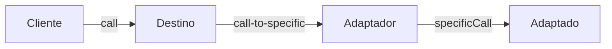
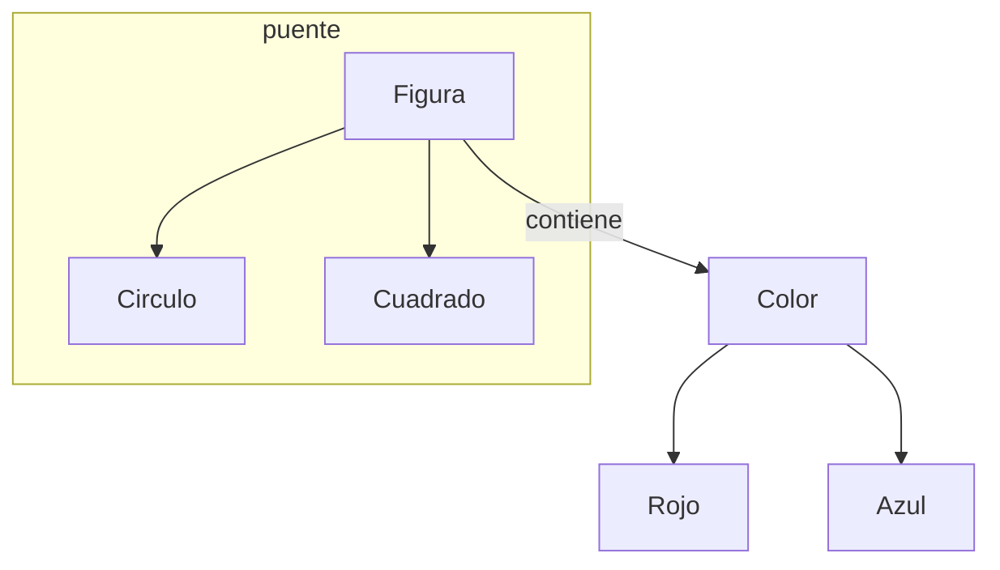
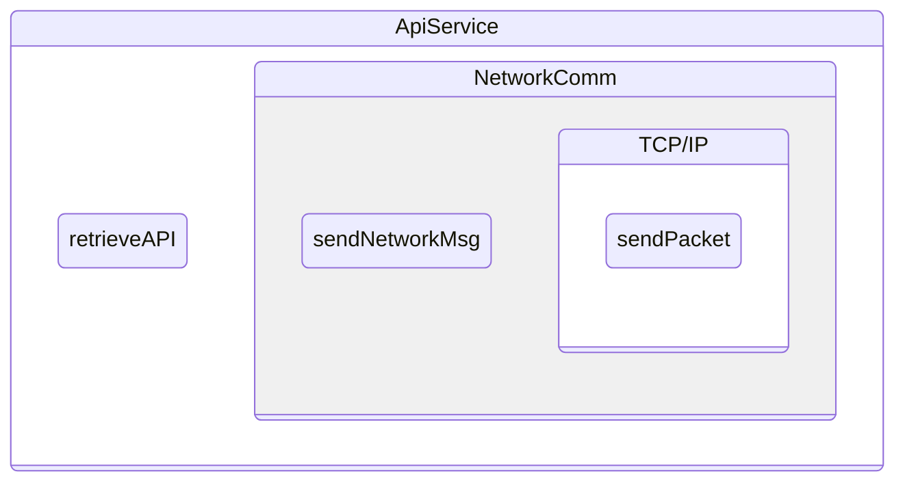
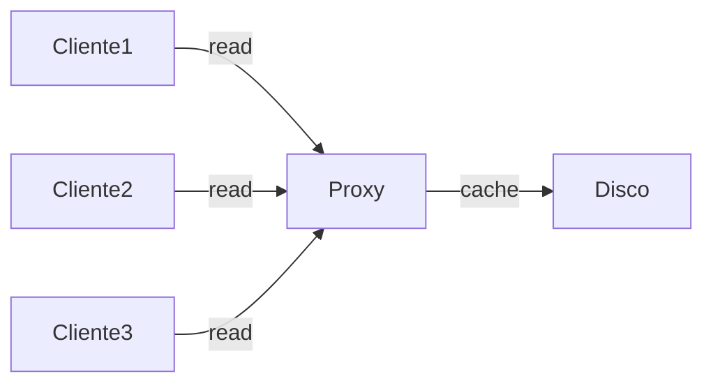
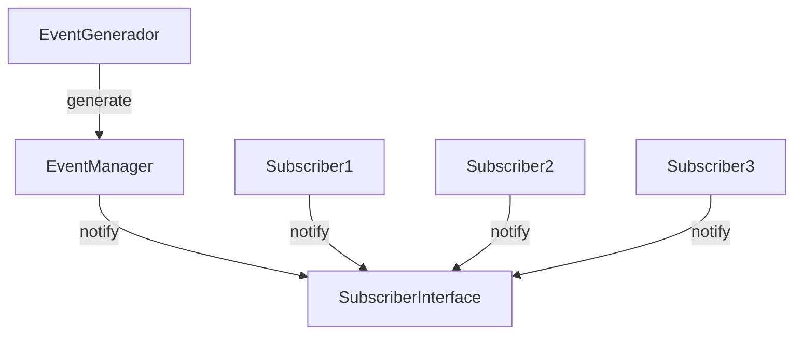
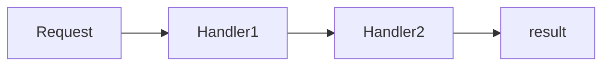
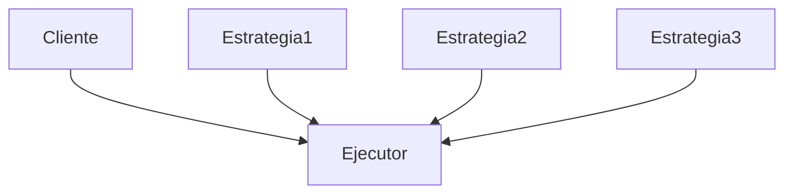

# Kotlin Design Patterns

Patrones de diseño para Kotlin

## Tipos de Patrones de Diseño

- Creación
  - Manejan creación de objeto
  - Como se crea una instancia una clase
- Estructural
  - Como los objetos y componentes de la aplicación se relacionan
  - Como se estructura el código para lograr
    - Separación de responsabilidades
    - Mejora lo escalable de la aplicación
    - Testability
- Comportamiento
  - Como los objetos funcionan dentro del código
  - Como la estrategia afecta la estructura de la app
  - Como los objetos se comunican

---

## Patrones de Creación

### Singleton

- Cuando se necesita solo una instancia de la clase
  - Punto de acceso único (red, bases de datos, etc)
  - Clases de utilidad
- Se declara la clase como `object`

```kotlin

object Singleton {
  init {
    // lógica
  }
}
```

### Factory

- Provee el acceso a funcionalidad sin preocuparse por la implementación
- Separación de responsabilidades
- Mejora la testability

### Abstract Factory

- Un nivel arriba de factory
- Funcionalidad sin preocuparse de la implementación
- Separación de responsabilidades

### Builder

- Usado cuando se tienen varios parámetros de inicio
  - Es mejor que hacer un constructor si hay parámetros opcionales
  - 5 parámetros en combinación es mas de 100 constructores
- Usado en Android
  - Kotlin usa parámetros que se pueden referir por nombre

### Lazy Init

- Es usado para el manejo de memoria
- Se evitan tener objetos grandes en memoria si no son utilizados
- Inicializa el recurso cuando es utilizado, no cuando es declarado
- Kotlin tiene dos maneras de hacer inicio diferido
  - `by lazy` que solo puede ser usado con `val`
  - `lateinit` que solo puede ser usado con `var`

### Prototype

- Permite hacer una copia del objeto
- El objeto provee la funcionalidad de copia

---

## Patrones Estructurales

### Adapter

- Convierte la interfaz de una clase en una que el cliente espera
- Convierte datos de un formato a otro
- Es usado en Android con frecuencia



### Bridge

- Clases con multiples propiedades ortogonales incrementan exponencialmente el árbol de herencia
- Se divide la estructura en varias interfaces o clases
- Se asocian por medio de un puente



### Facade

- Provee una interface simple para funcionalidad compleja
- Simplifica la implementación de clientes

### Decorator

- Pone nuevo comportamiento o funcionalidad a un objeto existe
- Cambia el comportamiento existente
- No se cambia el código original



### Composite

- Compone objetos en estructuras de árbol
- La funcionalidad puede ser representada por un árbol
- Se manipulan los componentes como uno solo

### Proxy

- Provee de funcionalidad antes y/o después de llamar al objeto
- Similar a facade, excepto que proxy tiene la misma interfaz del backend
- Similar a decorador, excepto que proxy maneja el ciclo de vida de su objeto



## Tema 4: Patrones de Comportamiento

### Observer

- Notifica a suscriptores de que un evento ha sucedido
- Notifica a multiples objetos simultáneamente
- Es una relación uno a muchos 




### Chain of Responsibility

- Define una cadena de procesadores para manejar una solicitud
- Cada procesador necesita una referencia al siguiente procesador en la cadena
- Cada procesador procesa la petición y pasa al siguiente procesador
- Las peticiones pueden ser de diferentes tipos



### Command

- Una solicitud esta envuelta en un objeto que tiene toda la información para procesarla
- El objeto es pasado al procesador correcto, o despachador

### Strategy
 
- Describe un algoritmo que puede ser cambiado en ejecución
- El objeto contiene la lógica algorítmica
- El objeto de contexto puede manejar el objeto algorítmico



### State

- Un objeto cambia su comportamiento de acuerdo al estado interno
- En cada momento en particular, hay un numero finito de estados 
- El estado puede ser encapsulado en un objeto

### Visitor

- Separa el algoritmo y el objeto
- Hay dos conceptos
  - Visitor
  - Elemento
- El Elemento acepta Visitor
- El Visitor hacen la operación sobre los elementos


### Mediator

- Provee un objeto central usado para la comunicación entre objetos
- Los objetos no hablan entre si, solo entre un mediador
- Se reduce la dependencia entre objetos

### Memento

-
